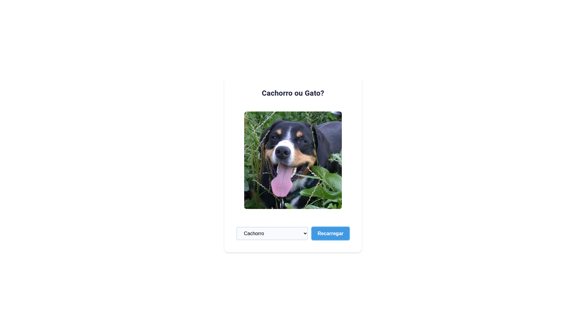

# 🐶🐱 Cão ou Gato?

Este projeto exibe imagens aleatórias de cães e gatos, consumindo APIs públicas e apresentando uma interface moderna, responsiva e agradável.

## 🛠️ Tecnologias
   

## ✨ Features
- Exibe imagens aleatórias de cachorros e gatos.
- Interface responsiva e amigável para dispositivos móveis.
- Consumo de APIs públicas para imagens.
- Visual moderno e fácil de usar.